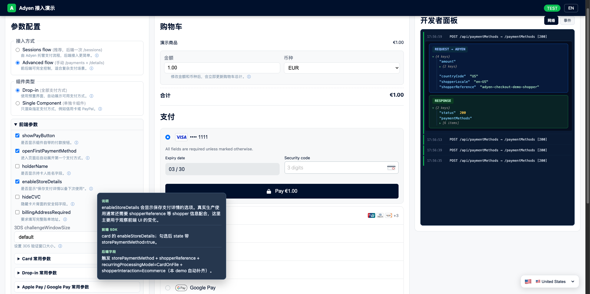

# Adyen 支付演示

[English](./README.md)



一个超轻量的 Adyen 测试支付演示。你可以切换 Sessions/Advanced 流程、Drop-in/单组件，并在开发者面板查看请求、响应和事件。

## 快速开始

```bash
npm install
cp .env.example .env
npm start
```

打开浏览器访问：

```text
http://localhost:8080
```

## 配置

详细设置说明请参考 [CONFIGURATION.md](./CONFIGURATION.md)。

### 环境

- **默认环境**：`test`（Adyen 测试环境）
- **API 版本**：`v71`

### 快速开始：本地开发

**方式 1：使用 `.env` 文件（推荐）**

```bash
cp .env.example .env
```

然后在 `.env` 中填入你的 Adyen 测试凭证：

```text
ADYEN_API_KEY=YOUR_TEST_API_KEY
ADYEN_MERCHANT_ACCOUNT=YOUR_MERCHANT_ACCOUNT
ADYEN_CLIENT_KEY=test_YOUR_CLIENT_KEY
```

**方式 2：使用环境变量**

在 shell 中设置环境变量：

```bash
export ADYEN_API_KEY=YOUR_TEST_API_KEY
export ADYEN_MERCHANT_ACCOUNT=YOUR_MERCHANT_ACCOUNT
export ADYEN_CLIENT_KEY=test_YOUR_CLIENT_KEY
npm start
```

应用会自动从环境变量读取凭证作为 fallback。

**重要**：确保 Client Key 的 "Allowed origins" 包含 `http://localhost:8080`。

### Netlify 部署

在 Netlify 的 Site settings > Build & deploy > Environment 中设置以下环境变量：

| 变量名 | 说明 |
|------|------|
| `ADYEN_API_KEY` | 从 Adyen Customer Area 获取 |
| `ADYEN_MERCHANT_ACCOUNT` | 商户账号 |
| `ADYEN_CLIENT_KEY` | 客户端密钥（需添加 Netlify URL 到允许域名） |

部署后，将你的 Netlify 网站 URL（如 `https://yourapp.netlify.app`）添加到 Adyen 的 Client Key "Allowed origins" 中。

## 功能特性

- **双流程集成**：Sessions（推荐）vs Advanced
- **组件类型**：Drop-in（一体化）vs 单组件（卡片、钱包等）
- **已保存支付方式**：支持保存卡片并可删除
- **支付行项目**：完整支持 Klarna、Afterpay、Ratepay
- **开发者工具**：Network/Events 标签、合并的请求/响应日志、彩色指示
- **多语言**：中文/英文 UI 切换
- **测试卡预设**：快速复制到剪贴板
- **3DS 配置**：验证窗口大小选择器
- **国家选择器**：固定小部件用于测试不同地区

## 项目结构

```
.
├── public/                      # 前端（静态资源）
│   ├── index.html              # HTML 布局
│   ├── app.js                  # 前端逻辑与 SDK 集成
│   └── styles.css              # 样式表
├── netlify/functions/          # Netlify Functions（无服务器后端）
│   ├── api.js                  # 统一 API 路由
│   ├── shared.js               # Adyen API 工具函数
│   └── config.js, sessions.js, 等  # 各端点函数
├── server.js                   # Express 服务器（本地开发）
├── .env.example                # 环境变量模板
├── netlify.toml                # Netlify 构建配置
└── README.md, README.zh.md     # 文档
```

## 本地开发 vs Netlify 部署

**本地**：`npm start` 运行 `server.js`（Express 后端，端口 8080）

**Netlify**：前端从 `public/` 提供，后端通过 Netlify Functions 的 `/.netlify/functions/api`

## 仓库

[https://github.com/Rickliang/adyen-checkout-demo](https://github.com/Rickliang/adyen-checkout-demo)
